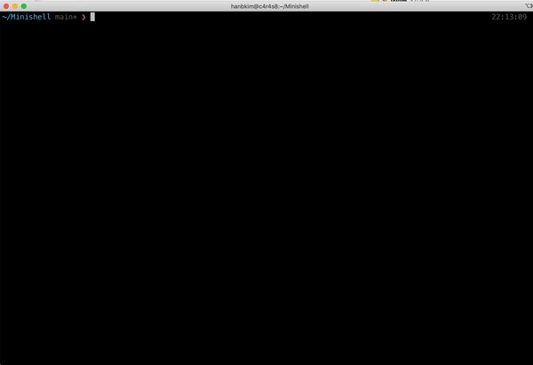

# Minishell
  

###### 커널과 애플리케이션의 중간지점인 Shell 프로그램을 만든 프로젝트입니다.
---

## 1. 소개
42서울에서 진행한 과제입니다.  
Minishell은 다음과 같은 기능을 제공합니다. 

- command History (방향키 위, 아래)
- redirection (<, >)
- heredoc (<<)
- pipe (|)
- operator (||, &&)
- wildcard (*)
- enviroment variable ($)
- builtin (echo, cd, pwd, export, unset, env, exit)

이 프로그램은 다음과 같은 제약 속에서 작성되었습니다.
- [norminette](https://github.com/42School/norminette/blob/master/pdf/en.norm.pdf)[(번역본)](https://github.com/42School/norminette/blob/master/pdf/ko.norm.pdf) 규칙 준수.
- 하나의 전역변수만 사용.

프로젝트를 진행하며 중요하게 느꼈던 점은 다음과 같습니다.
- 문자열 파싱 규칙 정의
- 프로세스간의 통신
- 파이프 통신 병렬 처리
- 부모 프로세스와 자식 프로세스의 Signal 처리

---

## 2. 설치 및 실행

본 프로젝트는 다음과 같은 환경에서 작성 되었습니다.

Apple clang version 12.0.0 (clang-1200.0.32.28)  
GNU Make 3.81  
GNU readline 8.2.1

1. readline library가 설치되어있지 않다면, 다음 명령어를 통해 설치합니다.

		brew install readline
2. 저장소를 복제합니다.

		git clone https://github.com/nickdotht/minishell.git
3. 컴파일 후 실행합니다.

		cd Minishell && make && ./minishell

--- 
## 3. 구성원

[박지윤 jiyunpar](https://github.com/flowjiyun)

[지준혁 junji](https://github.com/ji-junhyuk)

[김한빈 hanbkim](https://github.com/kimchijinju)

[서채원 cheseo](https://github.com/veggie-garden)

총 4명의 구성원이 문제를 해결하기 위해 함께 고민하고 같은 장소에 모여 프로젝트를 진행했습니다.
또, Pair Programming 기법을 사용하여 코드를 작성했습니다.
다음은 프로젝트를 진행하며 정리해둔 문서입니다.
1. [Minishell 구조 및 실행 로직](execution_structure_logic.md)
2. [구현 todolist](todolist.md)
3. [참고한 Bash 문서 정리](bash_man_summary.md)
4. [입력받을 수 있는 케이스](case.md)
